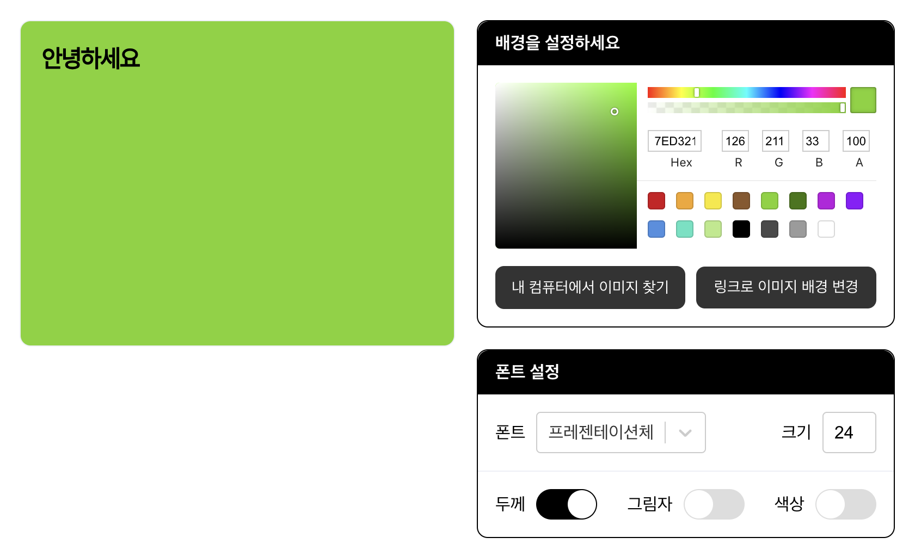

# 나만의 카드 만들기

카드의 배경과 폰트를 변경하며 나만의 카드를 만들고, 카드 이미지를 다운받을 수 있습니다.

### 작업 내용

- [x] UI 디자인 및 퍼블리싱
- [x] ColorPicker를 이용해 카드 배경색 변경할 수 있는 기능
- [x] 카드에 텍스트를 추가하고 폰트 스타일(글씨체, 크기, 두께, 그림자, 색상) 변경할 수 있는 기능

### 작업 예정

- [ ] 내 컴퓨터, 이미지 주소로 카드 배경이미지 변경할 수 있는 기능
- [ ] 카드 이미지를 다운로드 받을 수 있는 기능

### 기술 스택

React, TypeScript, Styled-components, React-switch, React-color, React-select
